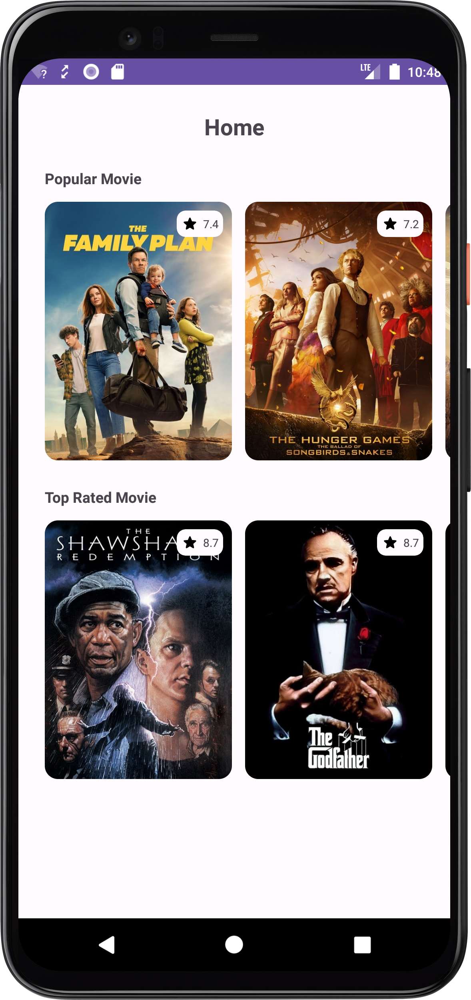
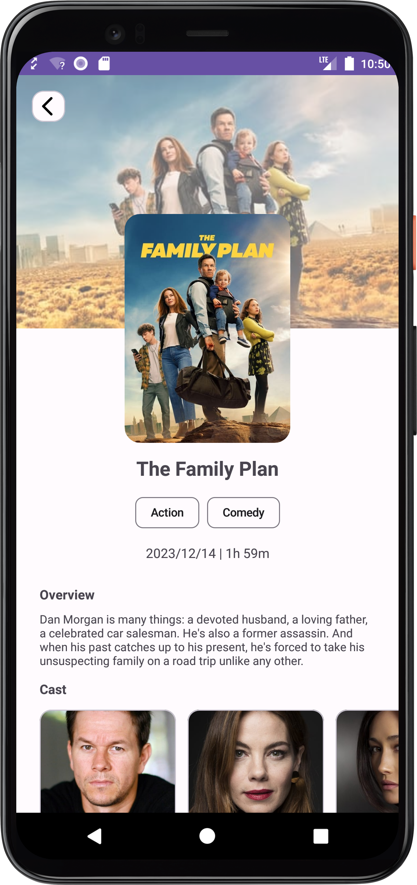

# Movie App
a simple app to show a list of movie and detail movie

### Libraries

* MVVM (Model View ViewModel)
* API Client [Retrofit](https://square.github.io/retrofit/)
* Local Storage [Room](https://developer.android.com/jetpack/androidx/releases/room) (but still not implement)
* Navigation Component
* Dependency Injection [Koin](https://insert-koin.io/)
* Logging Interceptor [Chucker Interceptor](https://github.com/ChuckerTeam/chucker)

### Public API
This project using public API from [TMDB API](https://developer.themoviedb.org/)

### Screenshots

 
